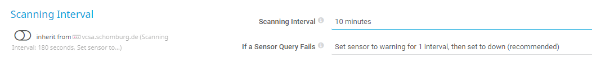
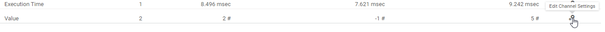
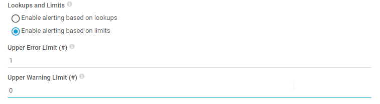
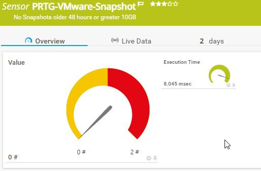
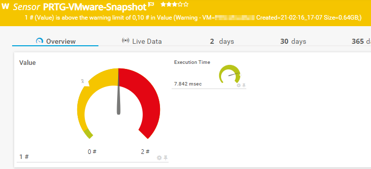
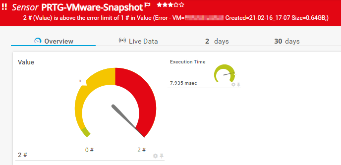

# PRTG-VMware-Snapshot
# About

## Project Owner:

Jannos-443

## Project Details

This Sensor Monitors Snapshots with specific Age or Size.

Default Values:
- WarningHours = 24 (hours)
- ErrorHours = 48 (hours)
- WarningSize = 10 (GB)
- ErrorSize = 20 (GB)

## HOW TO

1. Download PSx64.exe from PRTG Tools Familiy https://prtgtoolsfamily.com/downloads/sensors

2. Make sure the VMware PowerCLI Module exists on the Probe under the Powershell Module Path
   - C:\Program Files\WindowsPowerShell\Modules\VMware.VimAutomation.Core

3. Place "PSx64.exe" and "PRTG-VMware-Snapshot-Age.ps1" under "C:\Program Files (x86)\PRTG Network Monitor\Custom Sensors\EXE"

4. Create new Sensor PSx64.exe -f="PRTG-VMware-Snapshot.ps1" -p="%VCenter%" "%Username%" "%PW%"
   - Set "Scanning Interval" to min "10 minutes"



5. Change "Value" Channel >> "Lookups and Limits" to "Enable alerting based on limits"
   - Upper Error Limit 1
   - Upper Warning Limit 0,1



6. Set the "$IgnorePattern" or "$IgnoreScript" parameter to Exclude VMs


## Examples




VM exceptions
------------------
You can either use the **parameter $IgnorePattern** to exclude a service on sensor basis, or set the **variable $IgnoreScript** within the script. Both variables take a regular expression as input to provide maximum flexibility. These regexes are then evaluated againt the **VM Name**

By default, the $IgnoreScript varialbe looks like this:

```powershell
$IgnoreScript = '^(VMTest123|TestExcludeWildcard.*)$'
```

For more information about regular expressions in PowerShell, visit [Microsoft Docs](https://docs.microsoft.com/en-us/powershell/module/microsoft.powershell.core/about/about_regular_expressions).

".+" is one or more charakters
".*" is zero or more charakters
