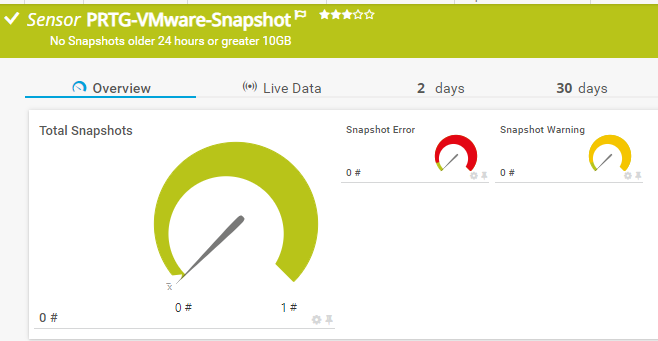

# PRTG-VMware-Snapshot
# About

## Project Owner:

Jannos-443

## Project Details

This Sensor Monitors Snapshots with specific Age or Size.

| Parameter | Default Value |
| --- | --- |
| WarningHours | 24 (hours) |
| ErrorHours | 48 (hours) |
| WarningSize | 10 (GB) |
| ErrorSize | 20 (GB) |

## HOW TO

1. Make sure the VMware PowerCLI Module exists on the Probe under the Powershell Module Path
   - `C:\Program Files\WindowsPowerShell\Modules\VMware.VimAutomation.Core`

2. Place `PRTG-VMware-Snapshot-Age.ps1` under `C:\Program Files (x86)\PRTG Network Monitor\Custom Sensors\EXEXML`

3. Create new Sensor

   | Settings | Value |
   | --- | --- |
   | EXE/Script | PRTG-VMware-Snapshot.ps1 |
   | Parameters | -ViServer 'yourVCenter' -User 'yourUser' -Password 'yourPassword' |
   | Scanning Interval | 10 minutes |

4. Set the "$IgnorePattern" or "$IgnoreScript" parameter to Exclude VMs

## Examples
Example Call: 

`PRTG-VMware-Snapshot.ps1 -ViServer 'yourVCenter' -User 'yourUser' -Password 'yourPassword' -IgnorePattern '^(TestVM.*)$'`

VM exceptions
------------------
You can either use the **parameter $IgnorePattern** to exclude a VM on sensor basis, or set the **variable $IgnoreScript** within the script. Both variables take a regular expression as input to provide maximum flexibility. These regexes are then evaluated againt the **VM Name**

For more information about regular expressions in PowerShell, visit [Microsoft Docs](https://docs.microsoft.com/en-us/powershell/module/microsoft.powershell.core/about/about_regular_expressions).

".+" is one or more charakters
".*" is zero or more charakters
