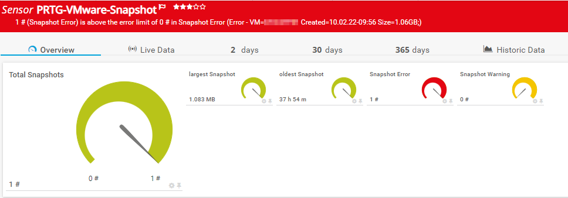

# PRTG-VMware-Snapshot.PS1

<!-- ABOUT THE PROJECT -->
### About The Project
Project Owner: Jannos-443

PRTG Powershell Script to monitor VMware Snapshots

Free and open source: [MIT License](https://github.com/Jannos-443/PRTG-VMware-Snapshot/blob/main/LICENSE)

**Features**
* Monitor Snapshot Size
* Monitor Snapshot Age
* Excludes/Includes
  * VMName Exclude
  * VMFolder Exclude
  * VMRessource Exclude
  * VMHost Exclude
  * SnapshotName Exclude 
  * SnapshotDescription Exclude


| Parameter | Default Value |
| --- | --- |
| WarningHours | 24 (hours) |
| ErrorHours | 48 (hours) |
| WarningSize | 10 (GB) |
| ErrorSize | 20 (GB) |


<!-- GETTING STARTED -->
## Getting Started

1. Make sure the VMware PowerCLI Module exists on the Probe under the Powershell Module Path
   - `C:\Program Files\WindowsPowerShell\Modules\VMware.VimAutomation.Core`


2. Place `PRTG-VMware-Snapshot.ps1` under `C:\Program Files (x86)\PRTG Network Monitor\Custom Sensors\EXEXML`

3. Create new sensor

   | Settings | Value |
   | --- | --- |
   | EXE/Script Advanced | PRTG-VMware-Snapshot.ps1 |
   | Parameters | -ViServer 'yourVCenterFQDN' -User 'yourUser' -Password 'yourPassword' |
   | Scanning Interval | 10 minutes |


4. Change parameter if needed 
   - Include/Exclude
   - Change Limits

## Usage

```powershell
-ViServer 'yourVCenterFQDN' -User 'yourUser' -Password 'yourPassword' -ExcludeVMName '^(TestVM.*)$'
```
Exclude all VMs with Names that start with "TestVM"

```powershell
-ViServer 'yourVCenterFQDN' -User 'yourUser' -Password 'yourPassword' -ExcludeVMHost '^(ESXI-Test.contoso.com)$'
```
Exclude all VMs on the VMHost "ESXI-Test"

```powershell
-ViServer 'yourVCenterFQDN' -User 'yourUser' -Password 'yourPassword' -ExcludeFolder '^(Test)$'
```
Excude all VMs in the folder "Test"

```powershell
-ViServer 'yourVCenterFQDN' -User 'yourUser' -Password 'yourPassword' -ExcludeFolder '^(Test|unimportant)$'
```
Excude all VMs in the folders "Test" AND "unimportant"

```powershell
-ViServer 'yourVCenterFQDN' -User 'yourUser' -Password 'yourPassword' -IncludeFolder '^(Test2)$'
```
ONLY monitor VMs in the folder "Test2"

## Examples




## Includes/Excludes

You can use the variables to exclude/include VM(s)/Snapshots(s) 
The variables take a regular expression as input to provide maximum flexibility.

For more information about regular expressions in PowerShell, visit [Microsoft Docs](https://docs.microsoft.com/en-us/powershell/module/microsoft.powershell.core/about/about_regular_expressions).

".+" is one or more charakters
".*" is zero or more charakters
